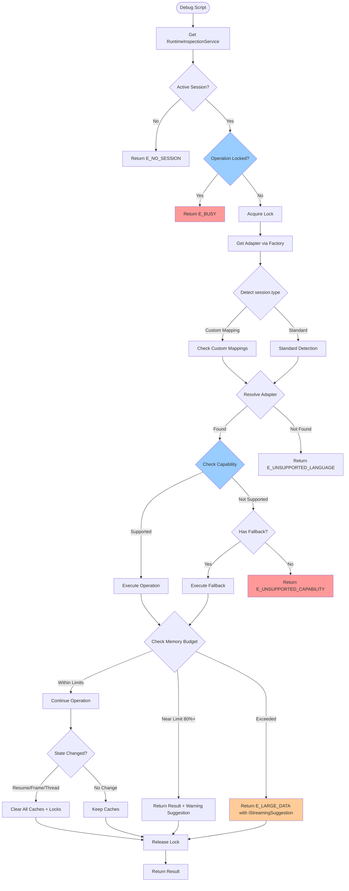

# Runtime Inspection Service Layer

This module provides the service layer architecture for debug session inspection and variable exploration in VSC Bridge.

## Overview

The runtime inspection system follows an adapter pattern to support multiple programming languages through VS Code's Debug Adapter Protocol (DAP). It provides:

- **Language-agnostic interface** for variable inspection
- **Automatic adapter selection** based on debug session type
- **Memory budget enforcement** to prevent extension crashes
- **Reference lifecycle management** per DAP specification

## Quick Start

Get started with runtime inspection in 3 lines:

```typescript
import { RuntimeInspectionService } from './core/runtime-inspection';

// Get the service singleton and adapter for the active debug session
const service = RuntimeInspectionService.getInstance();
const adapter = service.getAdapter();

// Check for errors (no session, unsupported language, etc.)
if ('code' in adapter) {
    console.error(`Error: ${adapter.message}`);
    return;
}

// List variables with default settings
const variables = await adapter.listVariables({
    maxDepth: 2,
    scopeFilter: 'local'
});

// Handle results
if ('code' in variables) {
    console.error(`Error: ${variables.message}`);
} else {
    console.log(`Found ${variables.length} variables`);
}
```

**Key Points:**
- Service is a singleton - call `getInstance()` anywhere
- Always check if result has `code` property (indicates error)
- Adapters automatically selected based on `session.type`
- Memory budget (20k nodes, 5MB) enforced automatically

## Architecture

### Components

#### RuntimeInspectionService (Singleton)
Central coordinator that manages debug sessions and their adapters.

```typescript
const service = RuntimeInspectionService.getInstance();
const adapter = service.getAdapter(); // Gets adapter for active session
```

#### AdapterFactory
Creates appropriate adapters based on session.type (per Critical Discovery 04).

```typescript
const factory = service.getFactory();
factory.registerAdapter('pwa-node', NodeDebugAdapter);
```

#### BaseDebugAdapter (Abstract)
Base class providing common DAP operations and memory management.

```typescript
export abstract class BaseDebugAdapter implements IDebugAdapter {
    protected readonly memoryBudget: IMemoryBudget;
    protected async getThreads(): Promise<any[]>;
    protected async getScopes(frameId: number): Promise<any[]>;
    public clearCaches(): void; // Per Critical Discovery 02
}
```

#### MemoryBudget
Dual budget tracker (nodes + bytes) preventing crashes from large data.

```typescript
const budget = new MemoryBudget(20000, 5 * 1024 * 1024); // 20k nodes, 5MB
const result = budget.addNode(byteSize);
if (!result.ok) {
    // Budget exceeded - result.reason indicates 'node-limit' or 'byte-limit'
    // result.remaining provides capacity info
}
```

### Service Layer Flow (Enhanced)

Per Subtask 001, the service layer now includes capability checking, operation locking, and lifecycle management:



### Cache Invalidation Policy

Per Subtask 001 ST006, the service layer implements conservative cache invalidation per Critical Discovery 02:

| Event | Trigger | Variable Cache | Scope Cache | Memory Budget | Operation Locks | Rationale |
|-------|---------|---------------|-------------|---------------|----------------|-----------|
| **Execution Resume** | `continued` DAP event | ✅ Clear | ✅ Clear | ✅ Reset | ✅ Clear | All refs invalid per DAP spec |
| **Frame Change** | `onDidChangeActiveStackItem` | ✅ Clear | ✅ Clear | ⚠️ Keep | ✅ Clear | Frame refs change, budget persists |
| **Thread Switch** | `onDidChangeActiveStackItem` | ✅ Clear | ✅ Clear | ⚠️ Keep | ✅ Clear | Thread refs change, budget persists |
| **Session End** | `onDidTerminateDebugSession` | ✅ Clear | ✅ Clear | ✅ Reset | ✅ Clear | Complete cleanup |
| **Breakpoint Change** | `onDidChangeBreakpoints` | ✅ Clear | ✅ Clear | ⚠️ Keep | ✅ Clear | Conservative: state might change |

**Principle**: "When in doubt, CLEAR" - Stale references are correctness bugs.

**Implementation**: BaseDebugAdapter wires up VS Code debug events and filters by `session.id`:

```typescript
vscode.debug.onDidTerminateDebugSession(session => {
    if (session.id === this.session.id) {  // CRITICAL: Filter by session!
        this.clearCaches();
        this.sessionAbortController.abort();
    }
});

vscode.debug.onDidChangeActiveStackItem(stackItem => {
    if (stackItem?.session.id === this.session.id) {
        this.clearCaches(); // Conservative clearing
    }
});
```

## Usage

### From Debug Scripts

```typescript
import { RuntimeInspectionService } from '../core/runtime-inspection';

// In your debug script execute() method
async execute(bridgeContext: BridgeContext, params: any) {
    const service = RuntimeInspectionService.getInstance();
    const adapterOrError = service.getAdapter();

    if ('code' in adapterOrError) {
        // Handle error (E_NO_SESSION, E_UNSUPPORTED_LANGUAGE, etc.)
        return { success: false, error: adapterOrError };
    }

    const adapter = adapterOrError;
    const variables = await adapter.listVariables({
        maxDepth: params.maxDepth || 2,
        scopeFilter: params.scopeFilter || 'all'
    });

    return { success: true, data: variables };
}
```

### Implementing Language Adapters

```typescript
import { BaseDebugAdapter } from '../core/runtime-inspection';

export class NodeDebugAdapter extends BaseDebugAdapter {
    constructor(session: vscode.DebugSession) {
        super(session, {
            supportsSetVariable: true,
            supportsVariablePaging: true,
            // ... other capabilities
        });
    }

    async listVariables(params: IListVariablesParams) {
        // Reset memory budget for new operation
        this.memoryBudget.reset();

        // Get threads and frames
        const threads = await this.getThreads();
        const frames = await this.getStackFrames(threads[0].id);
        const scopes = await this.getScopes(frames[0].id);

        // Traverse variables with budget tracking
        const variables = [];
        for (const scope of scopes) {
            const vars = await this.getVariables(scope.variablesReference);
            for (const v of vars) {
                const size = JSON.stringify(v).length;
                if (!this.memoryBudget.addNode(size)) {
                    // Budget exceeded - return what we have with suggestion
                    return this.createLargeDataError();
                }
                variables.push(v);
            }
        }

        return variables;
    }

    // Implement other required methods...
}
```

### Registering Adapters

Adapters are registered during extension activation:

```typescript
// In extension.ts or similar
import { RuntimeInspectionService } from './core/runtime-inspection';
import { NodeDebugAdapter } from './core/runtime-inspection/adapters/node-adapter';
import { CoreClrAdapter } from './core/runtime-inspection/adapters/coreclr-adapter';
import { DebugpyAdapter } from './core/runtime-inspection/adapters/debugpy-adapter';

export function activate(context: vscode.ExtensionContext) {
    const service = RuntimeInspectionService.getInstance();
    const factory = service.getFactory();

    // Register supported adapters
    factory.registerAdapter('pwa-node', NodeDebugAdapter);      // JavaScript (Node.js)
    factory.registerAdapter('node', NodeDebugAdapter);          // Legacy node adapter
    factory.registerAdapter('coreclr', CoreClrAdapter);         // C# (.NET)
    factory.registerAdapter('debugpy', DebugpyAdapter);         // Python
}
```

## Interfaces

### IDebugAdapter
Main interface all adapters must implement:

```typescript
interface IDebugAdapter {
    readonly session: vscode.DebugSession;
    readonly capabilities: IDebugCapabilities;

    listVariables(params: IListVariablesParams): Promise<IVariableData[] | IDebugError>;
    setVariable(params: ISetVariableParams): Promise<ISetVariableResult>;
    getVariableChildren(params: IVariableChildrenParams): Promise<IVariableData[] | IDebugError>;
    streamVariables(params: IStreamVariablesParams): Promise<IStreamResult>;
    evaluateExpression(expression: string, frameId?: number): Promise<any | IDebugError>;
    dispose(): void;
}
```

### IDebugCapabilities
Feature detection for language-specific functionality:

```typescript
interface IDebugCapabilities {
    supportsSetVariable: boolean;
    supportsVariablePaging: boolean;
    supportsVariableType: boolean;
    supportsMemoryReferences: boolean;
    // ... other capabilities from DAP spec
}
```

### IVariableData
Variable representation matching DAP specification:

```typescript
interface IVariableData {
    name: string;
    value: string;
    type?: string;
    variablesReference: number;  // 0 if no children
    namedVariables?: number;
    indexedVariables?: number;
    evaluateName?: string;       // Expression to access this variable
    memoryReference?: string;
    presentationHint?: IVariablePresentationHint;
}
```

## Critical Discoveries Applied

### Discovery 02: Variable Reference Lifecycle
Variable references become invalid when execution resumes.

**Implementation**: BaseDebugAdapter calls `clearCaches()` on state changes:
```typescript
public clearCaches(): void {
    this.variableCache.clear();
    this.scopeCache.clear();
    this.memoryBudget.reset();
}
```

### Discovery 03: Memory Budget Critical for Large Data
Attempting to load 1M+ element arrays crashes the extension host.

**Implementation**: Dual budget tracking with helpful errors:
```typescript
if (!this.memoryBudget.addNode(bytes)) {
    return createLargeDataError(
        this.memoryBudget.currentNodes,
        this.memoryBudget.currentBytes
    );
    // Returns: "Data exceeds 20,000 nodes or 5MB. Consider using debug.stream-variables..."
}
```

### Discovery 04: Language Detection via Session Type
Session.type property identifies the debugger.

**Implementation**: AdapterFactory auto-detects:
```typescript
createAdapter(session: vscode.DebugSession): IDebugAdapter | IDebugError {
    const sessionType = session.type; // 'pwa-node', 'debugpy', etc.
    const AdapterClass = this.supportedTypes.get(sessionType);

    if (!AdapterClass) {
        return createUnsupportedLanguageError(sessionType);
    }

    return new AdapterClass(session);
}
```

## Memory Budget System

The memory budget prevents extension crashes from large data structures:

### Limits
- **Nodes**: 20,000 maximum
- **Bytes**: 5MB maximum

### Behavior
- Tracks both simultaneously
- Stops traversal when either limit reached
- Returns partial data with suggestion
- Resets on each operation

### Example
```typescript
const budget = new MemoryBudget();

// Add nodes during traversal
for (const variable of variables) {
    const bytes = JSON.stringify(variable).length;
    if (!budget.addNode(bytes)) {
        // Budget exceeded
        console.log(budget.getSuggestion());
        // "Data exceeds 20,000 nodes or 5MB. Consider using debug.stream-variables..."
        break;
    }
}

// Check status
const status = budget.getStatus();
console.log(`Used ${status.percentNodes}% of node budget`);
console.log(`Used ${status.percentBytes}% of byte budget`);
```

## Error Handling

All errors use standardized codes from Phase 1:

```typescript
// No active session
{ code: 'E_NO_SESSION', message: '...', hint: '...' }

// Unsupported language
{ code: 'E_UNSUPPORTED_LANGUAGE', message: '...', hint: 'Supported: pwa-node, ...' }

// Memory budget exceeded
{ code: 'E_LARGE_DATA', message: '...', hint: 'Consider using debug.stream-variables...' }

// Stale reference
{ code: 'E_STALE_REFERENCE', message: '...', hint: 'References only valid while paused' }
```

## Testing

Run the manual test harness:

```bash
node /Users/jordanknight/github/vsc-bridge/scripts/test/test-service-layer.js
```

Tests validate:
- Singleton pattern
- Session registration
- Adapter creation (supported/unsupported languages)
- Memory budget enforcement (nodes and bytes)
- Cache invalidation

## Files

```
extension/src/core/runtime-inspection/
├── index.ts                          # Public API exports
├── interfaces.ts                     # All TypeScript interfaces
├── MemoryBudget.ts                   # Budget tracker implementation
├── RuntimeInspectionService.ts       # Singleton service
├── AdapterFactory.ts                 # Adapter creation factory
├── adapters/
│   └── BaseDebugAdapter.ts          # Abstract base class
└── README.md                        # This file

scripts/test/
└── test-service-layer.js            # Manual test harness
```

## Supported Languages

The runtime inspection service currently supports the following languages through their respective debug adapters:

| Language | Adapter | Session Type | Variable Inspection | Variable Modification | Pagination | Cycle Detection | Property Detection |
|----------|---------|--------------|---------------------|----------------------|------------|-----------------|-------------------|
| **JavaScript/Node.js** | NodeDebugAdapter | `pwa-node` | ✅ | ✅ | ✅ | ✅ | N/A |
| **C# (.NET)** | CoreClrAdapter | `coreclr` | ✅ | ✅ | ✅ | ✅ | N/A |
| **Python** | DebugpyAdapter | `debugpy` | ✅ | ✅ | ✅ | ✅ | ✅ (@property) |

### Python-Specific Features

The DebugpyAdapter includes Python-specific safety and usability features:

- **@property Detection**: Uses `inspect.getattr_static()` to detect `@property` decorators without triggering side effects (API calls, database writes, etc.)
- **GIL-Aware Threading**: Python's Global Interpreter Lock (GIL) means all threads stop together, enabling simpler thread detection
- **Special Type Handling**: Graceful handling of generators (exhaustible), coroutines (can't await), and None vs empty values
- **Cycle Detection**: Uses variablesReference tracking to detect circular references without calling Python's `id()` function

## Related Documentation

- [Debug Script Bake-In Plan](../../../../docs/plans/8-debug-script-bake-in/debug-script-bake-in-plan.md)
- [Phase 2 Tasks](../../../../docs/plans/8-debug-script-bake-in/tasks/phase-2-service-layer-architecture/tasks.md)
- [Error Codes](../errors/README.md)
